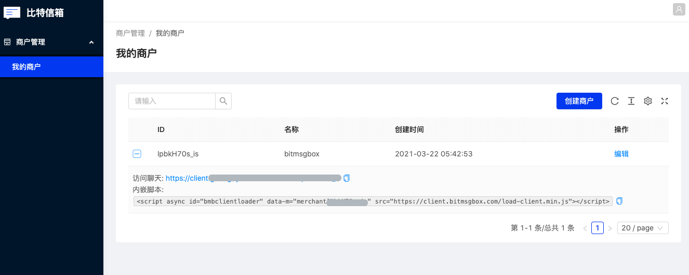

## 什么是客户--商户通讯服务?

客户--商户通讯是比特信箱目前已开通的唯一一种服务，用于解决像商户客服，联系博客博主等一对多的临时通讯会话场景，当然直接把聊天链接分享给朋友，临时建立会话也是允许的


## 接入服务

打开[商户管理界面](https://https://panel.bitmsgbox.com/#/merchant/list), 注册并登录后，界面如果下图所示:



***如果没看到任何商户***请点击右上角的创建商户按钮创建一个商户

### 站外网页聊天窗口

要使用站外网页聊天窗口，只需直接打开上图所示的"访问聊天"网站链接即可与创建此商户的账户建立聊天会话

### 嵌入聊天窗口到您的网站

聊天窗口也可以嵌入至您的网站右下角，具体效果如本站右下角的所示的比特信箱logo, 点击logo即可弹出聊天窗口。
在我的商户界面找到您需要接入的商户，复制上图中所示的"内嵌脚本"，粘贴在您的网站HTML的`<head>`节点内即可

例如:
```html
<!DOCTYPE html>
<html lang="en">
<head>
  <meta charset="UTF-8">
  <meta http-equiv="X-UA-Compatible" content="IE=edge">
  <meta name="viewport" content="width=device-width, initial-scale=1.0">
  <title>Document</title>
  <!-- This script -->
  <script async id="bmbclientloader" data-m="merchantegR3_kuvA" src="https://client.bitmsgbox.com/load-client.min.js"></script>
</head>
<body>
  
</body>
</html>
```